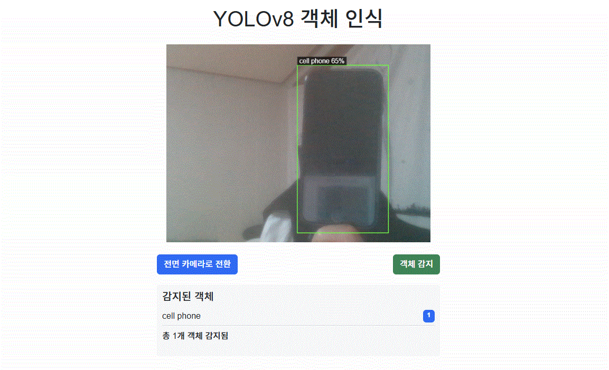
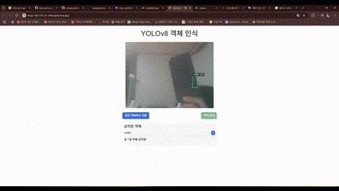

# 📷 YOLOv8 실시간 객체 인식 웹서비스

Google Colab 환경에서 **YOLOv8 + Flask + React + ngrok**을 활용해 구축한 **모바일 카메라 기반 실시간 객체 인식 서비스**입니다.

<div align="center">
  
</div>

---

## 🚀 데모 시연 (GIF)

<div align="center">
  
</div>

---

## 주요 기능

-  전면 / 후면 카메라 전환 (모바일 대응)
-  10초 주기 자동 이미지 캡처 및 객체 탐지
-  YOLOv8 기반 실시간 객체 인식
-  인식된 객체를 bounding box 및 리스트로 시각화
-  React 기반 간결한 사용자 인터페이스
-  Colab + ngrok을 통한 외부 접속 가능

---

## 사용 기술

| 분류       | 스택 |
|------------|------|
| 프론트엔드 | React (CDN 기반), HTML5, Bootstrap |
| 백엔드     | Flask, YOLOv8 (`ultralytics`), Python |
| 배포       | Google Colab, pyngrok |
| 기타       | OpenCV, Base64 처리, Canvas API |

---

## 시스템 아키텍처

```plaintext
[Mobile Browser]
        ↓
[React + HTML UI]
        ↓
[10초 주기 이미지 캡처 (base64)]
        ↓
[Flask API (/api/detect)]
        ↓
[YOLOv8 객체 감지]
        ↓
[감지 결과 반환 → UI 시각화]
